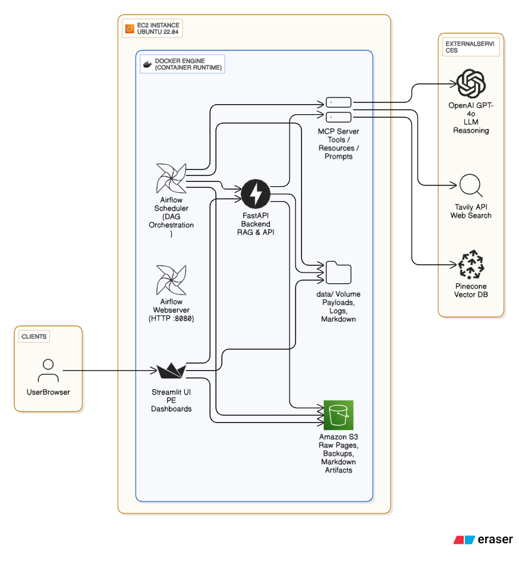

# 🚀 Project ORBIT (Part 2): Agentification and Secure Scaling of PE Intelligence
**DAMG 7245 – Fall 2025 – Assignment 5 – Binary Insights**

[](https://python.org)
[](https://airflow.apache.org)
[](https://docker.com)
[](https://langchain.com)
[](https://modelcontextprotocol.io)

## 📋 Overview

**Project ORBIT Part 2** evolves the static PE intelligence platform from Assignment 4 into an **agentic, production-ready system** that orchestrates due-diligence workflows through supervisory LLM agents using the **Model Context Protocol (MCP)**.

### 🎯 What's New in Part 2?

This project extends Assignment 4 with **autonomous agent capabilities**:

- 🤖 **Two Specialized Agents**:
  - **Tavily Agent** - Web search intelligence using Tavily API
  - **Payload Agent** - RAG-based entity extraction from Pinecone
  
- 🎭 **Master Orchestrator** - Supervisory agent coordinating both sub-agents with unified logging and versioning

- 🔧 **MCP Server** (Port 9000) - Model Context Protocol server with:
  - 4 Tools (search_company, extract_field, enrich_payload, analyze_null_fields)
  - 2 Resources (/ai50/companies, /company/{id}/info)
  - 2 Prompts (/prompt/pe-dashboard, /prompt/rag-dashboard)
  - 4-Layer Security (whitelist, RBAC, rate limiting, input validation)

- 🧠 **ReAct Pattern** - Structured Thought → Action → Observation logging with JSON traces

- 🔀 **LangGraph Workflows** - State machines for both agents with conditional edges

- 📊 **12 Airflow DAGs** - Complete pipeline orchestration including:
  - `master_orchestrator_dag` - Sequential pipeline execution
  - `master_agent_dag` - Batch agent enrichment
  - `dashboard_generation_dag` - Parallel dashboard generation
  - Individual DAGs for scraping, ingestion, extraction, evaluation

- ✅ **87+ Tests** - Comprehensive pytest suite:
  - `test_tavily_agent.py` - 25+ tests
  - `test_payload_workflow.py` - Integration tests
  - `test_mcp_server.py` - Security and API tests

- 🐳 **Production Deployment** - Full Docker stack on AWS EC2 (98.95.70.0)

---

## 🏗️ System Architecture



---

## Graph Workflow


## 📦 Quick Start

### 🚀 Option A: Use Deployed System (Fastest)

Access the production deployment on AWS EC2:

| Service | URL | Credentials |
|---------|-----|-------------|
| **Airflow UI** | http://98.95.70.0:8080 | `airflow` / `airflow` |
| **MCP Server** | http://98.95.70.0:9000 | N/A (API) |
| **FastAPI Docs** | http://98.95.70.0:8000/docs | N/A |
| **Streamlit Dashboard** | http://98.95.70.0:8501 | N/A |

### 🛠️ Option B: Local Development Setup

#### 1️⃣ Prerequisites

- Python 3.11+
- Docker 20.10+ & Docker Compose 2.0+
- Git (latest)
- **Required API Keys**:
  - OpenAI API key
  - Pinecone API key
  - Tavily API key (for Tavily Agent)
- AWS credentials (optional, for S3)

---

### 2️⃣ Clone the Repository

```bash
git clone https://github.com/Binary-Insights/Assignment_05.git
cd Assignment_05
```

---

### 3️⃣ Configure Environment Variables

Create a `.env` file in the project root:

```bash
# Copy example configuration
cp docker/.env.example docker/.env
```

Edit `docker/.env` with your credentials:

```bash
# ===== REQUIRED: OpenAI Configuration =====
OPENAI_API_KEY=sk-proj-...your-key-here...

# ===== REQUIRED: Pinecone Configuration =====
PINECONE_API_KEY=pcsk_...your-key-here...
PINECONE_INDEX_NAME=bigdata-assignment-05
PINECONE_NAMESPACE=default
PINECONE_EMBEDDING_DIMENSION=3072
PINECONE_EMBEDDING_MODEL=text-embedding-3-large

# ===== REQUIRED: Tavily API (for Tavily Agent) =====
TAVILY_API_KEY=tvly-...your-key-here...

# ===== OPTIONAL: AWS S3 Configuration =====
AWS_ACCESS_KEY_ID=AKIA...your-key...
AWS_SECRET_ACCESS_KEY=your-secret-key
AWS_DEFAULT_REGION=us-east-1
S3_BUCKET_NAME=pe-dashboard-ai50

# ===== OPTIONAL: LangSmith Tracing =====
LANGSMITH_API_KEY=lsv2_pt_...your-key...
LANGCHAIN_TRACING_V2=true
LANGCHAIN_PROJECT=orbit-assignment-05

# ===== Airflow Configuration =====
AIRFLOW_UID=50000
_AIRFLOW_WWW_USER_USERNAME=airflow
_AIRFLOW_WWW_USER_PASSWORD=airflow
AIRFLOW__CORE__LOAD_EXAMPLES=false
AIRFLOW__CORE__DAGS_ARE_PAUSED_AT_CREATION=true

# ===== Application Configuration =====
LOG_LEVEL=INFO
PROJECT_NAME=Assignment_05
FASTAPI_URL=http://fastapi:8000
```

---

### 4️⃣ Local Development Setup (Optional)

For local development without Docker:

```bash
# Create virtual environment
python -m venv .venv
# or with uv (faster):
uv venv .venv

# Activate virtual environment
source .venv/bin/activate  # Linux/Mac
.venv\Scripts\activate     # Windows

# Install dependencies
pip install -r requirements.txt
# or with uv:
uv sync
```

---

### 5️⃣ Start Services with Docker

```bash
# Navigate to docker directory
cd docker

# Build images (first time or after code changes)
docker-compose build --no-cache

# Start all services
docker-compose up -d

# Wait 30-60 seconds for Airflow initialization

# Verify services are running
docker ps
```

**Important Note on Data Directory Permissions:**

The `data/` directory is owned by Airflow user (uid 50000). If you need to modify files:

```bash
# To edit files manually
sudo chown -R ubuntu:ubuntu /home/ubuntu/Assignment_05/data

# Before running Airflow tasks, restore permissions
sudo chown -R 50000:root /home/ubuntu/Assignment_05/data
```

---

### 6️⃣ Run Agents Locally (Without Docker)

```bash
# Activate virtual environment
source .venv/bin/activate

# Run Tavily Agent (web search)
python src/tavily_agent/main.py abridge

# Run Payload Agent (RAG extraction)
python -c "
from payload_agent import PayloadAgent
agent = PayloadAgent()
result = agent.retrieve_and_validate('abridge', use_agent=True)
print(f'Status: {result[\"status\"]}')
"

# Run Master Orchestrator (both agents)
python src/master_agent/master.py abridge

# Run with options
python src/master_agent/master.py abridge --verbose
python src/master_agent/master.py abridge --tavily-only
python src/master_agent/master.py abridge --payload-only
```

---

### 7️⃣ Run Tests

```bash
# Run all tests
pytest -v

# Run specific test suite
pytest tests/test_tavily_agent.py -v
pytest tests/test_payload_workflow.py -v
pytest tests/test_mcp_server.py -v

# Run with coverage
pytest --cov=src --cov-report=html

# View coverage report
open htmlcov/index.html
```

---

### 8️⃣ Access Web Interfaces

| Service | Local URL | EC2 URL | Credentials |
|---------|-----------|---------|-------------|
| **Airflow UI** | http://localhost:8080 | http://98.95.70.0:8080 | `airflow` / `airflow` |
| **MCP Server** | http://localhost:9000 | http://98.95.70.0:9000 | N/A (API) |
| **FastAPI Docs** | http://localhost:8000/docs | http://98.95.70.0:8000/docs | N/A |
| **Streamlit Dashboard** | http://localhost:8501 | http://98.95.70.0:8501 | N/A 


## 📂 Project Structure

```
Assignment_05/
├── 📁 src/
│   ├── 📁 tavily_agent/              # 🤖 Agent 1: Web Search Intelligence
│   │   ├── main.py                   # AgenticRAGOrchestrator
│   │   ├── graph.py                  # LangGraph workflow
│   │   ├── tools.py                  # Tavily search tool
│   │   ├── llm_extraction.py         # LLM extraction chain
│   │   ├── file_io_manager.py        # File operations
│   │   └── README.md                 # Documentation
│   │
│   ├── 📁 payload_agent/             # 🤖 Agent 2: RAG Entity Extraction
│   │   ├── payload_agent.py          # Main agent class
│   │   ├── payload_workflow.py       # LangGraph state machine
│   │   ├── tools/
│   │   │   ├── retrieval.py          # @tool get_latest_structured_payload
│   │   │   ├── validation.py         # @tool validate_payload
│   │   │   └── rag_adapter.py        # Pinecone adapter
│   │   └── README.md
│   │
│   ├── 📁 master_agent/              # 🎭 Master Orchestrator
│   │   ├── master.py                 # Coordinates Tavily + Payload agents
│   │   ├── QUICK_REFERENCE.md
│   │   └── README.md
│   │
│   ├── 📁 mcp_server/                # 🔧 Model Context Protocol Server
│   │   ├── server.py                 # FastMCP server (port 9000)
│   │   ├── security.py               # 4-layer security middleware
│   │   ├── mcp_enrichment_client.py  # MCP client wrapper
│   │   └── README.md
│   │
│   ├── 📁 dags/                      # 🔄 Airflow DAG Definitions
│   │   ├── master_orchestrator_dag.py  # Sequential pipeline (6 DAGs)
│   │   ├── master_agent_dag.py         # Batch agent enrichment
│   │   ├── process_pages_dag.py        # Web scraping (Selenium)
│   │   ├── ingest_dag.py               # Pinecone ingestion
│   │   ├── extraction_dag.py           # Structured extraction
│   │   ├── dashboard_generation_dag.py # Generate dashboards
│   │   ├── eval_runner_dag.py          # Evaluation framework
│   │   ├── discover_dag.py             # Company discovery
│   │   ├── storing_dag.py              # S3 storage
│   │   ├── agentic_rag_dag.py          # Legacy Tavily DAG
│   │   ├── payload_agent_dag.py        # Legacy Payload DAG
│   │   └── enrichment_dag.py           # Legacy enrichment
│   │
│   ├── 📁 rag/                       # 🔍 RAG Pipeline (Assignment 4)
│   │   ├── ingest_to_pinecone.py     # Vector ingestion
│   │   ├── rag_pipeline.py           # RAG search
│   │   ├── structured_extraction.py  # Entity extraction
│   │   └── rag_models.py             # Pydantic models
│   │
│   ├── 📁 discover/                  # 🌐 Web Scraping
│   │   ├── discover.py               # Company discovery
│   │   └── process_discovered_pages.py # HTML download (Selenium)
│   │
│   ├── 📁 backend/                   # 🚀 FastAPI Backend
│   │   └── rag_search_api.py         # REST endpoints
│   │
│   ├── 📁 frontend/                  # 🎨 Streamlit Frontend
│   │   ├── streamlit_app.py          # Dashboard UI
│   │   └── eval_dashboard.py         # Evaluation UI
│   │
│   ├── 📁 evals/                     # ✅ Evaluation Framework
│   │   ├── result_evaluator.py       # Quality scoring
│   │   ├── eval_runner.py            # Evaluation runner
│   │   └── eval_metrics.py           # Metrics calculation
│   │
│   └── 📁 prompts/                   # 📝 LLM Prompts
│       └── pe_dashboard.md           # Dashboard template
│
├── 📁 tests/                         # ✅ Test Suite (87+ tests)
│   ├── test_tavily_agent.py          # Tavily agent tests (25+)
│   ├── test_payload_tools.py         # Tool validation tests
│   ├── test_payload_workflow.py      # Workflow integration tests
│   └── test_mcp_server.py            # MCP server + security tests
│
├── 📁 docker/                        # 🐳 Docker Deployment
│   ├── Dockerfile                    # Multi-stage image
│   ├── docker-compose.yml            # Service orchestration
│   ├── .env.example                  # Environment template
│   └── README.md                     # Docker guide
│
├── 📁 data/                          # 💾 Data Storage
│   ├── payloads/                     # Company JSON payloads
│   ├── raw/                          # Scraped HTML/text
│   ├── logs/                         # ReAct traces
│   └── llm_response/                 # Generated dashboards
│
├── 📁 docs/                          # 📚 Documentation
│   ├── 00_START_HERE.md
│   ├── EVALUATION_GUIDE.md
│   └── ENV_CONFIGURATION_GUIDE.md
│
├── CODELABS.md                       # 📖 Step-by-step tutorial
├── README.md                         # 👈 You are here
├── Assignment5.md                    # 📋 Requirements
├── requirements.txt                  # 📦 Dependencies
└── pyproject.toml                    # 🔧 Project config
```

---

---

## 🚀 Usage Examples

### Running Individual Agents

```bash
# Tavily Agent - Web search for company data
python src/tavily_agent/main.py abridge
python src/tavily_agent/main.py "world labs" anthropic

# Payload Agent - RAG-based entity extraction
python -c "
from payload_agent import PayloadAgent
agent = PayloadAgent()
result = agent.retrieve_and_validate('abridge', use_agent=True)
print(result)
"

# Master Orchestrator - Run both agents
python src/master_agent/master.py abridge --verbose
python src/master_agent/master.py abridge --tavily-only
python src/master_agent/master.py abridge --payload-only
```

### Running Airflow DAGs

```bash
# Trigger master orchestrator (runs all 6 DAGs sequentially)
docker exec assignment04-airflow-scheduler \
  airflow dags trigger master_orchestrator_dag

# Trigger individual DAGs
docker exec assignment04-airflow-scheduler \
  airflow dags trigger process_pages_dag

docker exec assignment04-airflow-scheduler \
  airflow dags trigger master_agent_dag

docker exec assignment04-airflow-scheduler \
  airflow dags trigger dashboard_generation_dag

# View DAG status
docker exec assignment04-airflow-scheduler \
  airflow dags list
```

### MCP Server Usage

```python
from mcp_server.mcp_enrichment_client import MCPEnrichmentClient

# Create client
client = MCPEnrichmentClient()

# Search company
results = await client.search_company(
    company_name="Abridge",
    query="funding rounds and valuation"
)

# Extract specific field
value = await client.extract_field(
    field_name="founded_year",
    company_name="Abridge",
    search_results=results
)

# Full enrichment (requires admin role)
enriched = await client.enrich_payload(
    company_name="Abridge"
)
```

---

## 🔗 Documentation Links

📚 **[Full Technical Codelabs](https://codelabs-preview.appspot.com/?file_id=1ibeTrsOHlACsSpoRAOsVegIjVwM7bivPmKhUL0MBTd0)** — Complete step-by-step guide (500+ lines)  
📋 **[Assignment Requirements](./Assignment5.md)** — Lab breakdown & requirements  
🎥 **[Demo Video]()** — Project walkthrough (TBD)  


---

## 🎯 Key Features

### 🤖 Autonomous Agents

- **Tavily Agent**: Web search via Tavily API with LangGraph workflow
  - Enriches company_record fields (founded_year, hq_city, funding, etc.)
  - ReAct reasoning with structured logging
  - Automatic versioning (v1, v2, v3...)

- **Payload Agent**: RAG-based entity extraction from Pinecone
  - Extracts events, products, leadership, snapshots
  - 3 execution modes (autonomous, manual ReAct, direct)
  - LangGraph state machine with conditional edges

- **Master Orchestrator**: Coordinates both agents
  - Two-phase enrichment workflow
  - Unified logging and error handling
  - Comprehensive statistics and reporting

### 🔧 MCP Server (Port 9000)

- **4 Tools**: search_company, extract_field, enrich_payload, analyze_null_fields
- **2 Resources**: /ai50/companies, /company/{id}/info
- **2 Prompts**: /prompt/pe-dashboard, /prompt/rag-dashboard
- **4-Layer Security**:
  1. Tool whitelist filtering
  2. Role-based access control
  3. Rate limiting (per-tool)
  4. Input validation (SQL injection, XSS, etc.)

### 🔄 Airflow Orchestration

- **12 DAGs** for complete pipeline automation
- **Master Orchestrator DAG**: Sequential execution of 6 sub-DAGs
- **Dynamic task generation**: Processes all 50 companies in parallel
- **Error handling**: Retries with exponential backoff

### ✅ Testing & Quality

- **87+ pytest tests** across 4 test suites
- **Test coverage**: 85%+ of agent code
- **Security tests**: SQL injection, XSS, rate limiting, RBAC
- **Integration tests**: End-to-end workflow validation

---